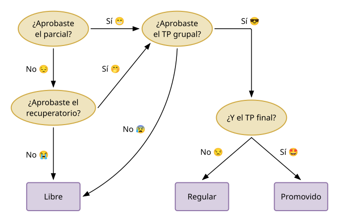
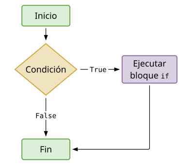
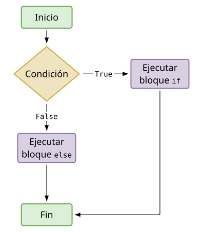
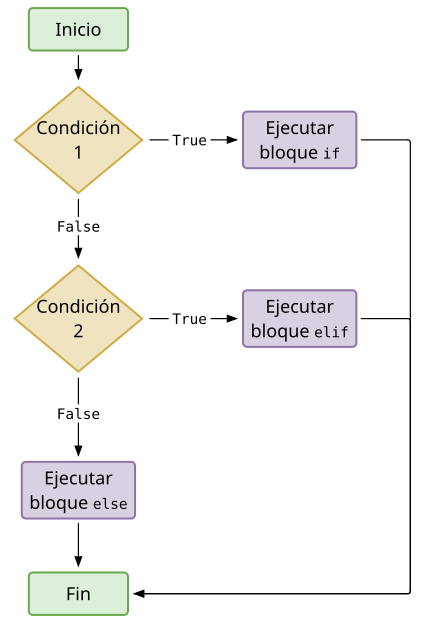
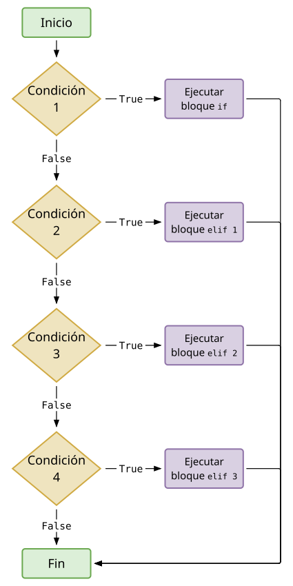

## Introducción

Las computadoras son muy buenas para muchísimas cosas. En particular:

* Determinar automáticamente que secciones de un programa se debe ejecutar.
* Realizar tareas repetitivas.

El primer punto se refiere a la **ejecución condicional de código** y el segundo a la **ejecución repetitiva de código**.

Estos dos puntos pueden ser vistos de manera general como **control de flujo** del código.
Y
En este apunte hablamos de la **ejecución condicional de código**.

{fig-align="center" width="90%"}

## Estructura `if`

La estructura condicional `if` utiliza la _keyword_ `if` para evaluar una condición y
ejecutar un bloque de código en base al resultado de esta evaluación.
Veamos dos ejemplos:

```python
condicion = True
if condicion:
    print("Se ejecuta el bloque if")
```

```text
Se ejecuta el bloque if
```

```python
condicion = False
if condicion:
    print("Se ejecuta el bloque if")
```

En el primer caso, `condicion` es `True`, se ejecuta el cuerpo del bloque `if` y
se observa el mensaje `Se ejecuta el bloque if`.
Por el contrario, en el segundo `condicion` es `False` y no se observa ningún mensaje,
ya que no se ejecuta el cuerpo del bloque `if`.

Los ejemplos anteriores utilizan una variable que es directamente `True` o `False`.
Sin embargo, en la gran mayoría de los casos, se utiliza una **expresión** que al evaluarse
genera valor booleano. Por ejemplo:

```python
nota = 8
if nota >= 6:
    print("¡Aprobado!")
```

```text
¡Aprobado!
```

O también:

```python
nota = 3
if nota >= 6:
    print("¡Aprobado!")
```

¿Cómo nos damos cuenta qué código está incluido dentro del bloque `if`? Veamos otros ejemplos:

```python
edad = 21
if edad >= 17:
    print("Puede sacar carnet de conducir")
    print("Diríjase al departamento de tránsito más cercano")
print("Siempre se muestra este mensaje")
```

```text
Puede sacar carnet de conducir
Diríjase al departamento de tránsito más cercano
Siempre se muestra este mensaje
```

```python
edad = 16
if edad >= 17:
    print("Puede sacar carnet de conducir")
    print("Diríjase al departamento de tránsito más cercano")
print("Siempre se muestra este mensaje")
```

```text
Siempre se muestra este mensaje
```

Mientras que el primer programa muestra tres líneas de texto, ya que se ejecuta el bloque `if`,
el segundo muestra solamente el mensaje del último `print()`. A diferencia de los dos primeros,
el último `print()` no está incluido en el bloque `if`.

Así, observamos que el fin de la indentación indica el fin del bloque de código,
al igual que cuando se define una función.

De manera general, una estructura condicional `if` se programa utilizando la siguiente estructura:


::: {style="margin: auto;"}
::: {.carousel id="carousel-01"}

::: {.item image="imgs/typst/svg/condicional-if-generico-1.svg" caption="Estructura condicional <code>if</code>."}
:::

::: {.item image="imgs/typst/svg/condicional-if-generico-2.svg" caption="Comienza con la <strong>palabra clave</strong> <code>if</code>."}
:::

::: {.item image="imgs/typst/svg/condicional-if-generico-3.svg" caption="Expresión a evaluar, que devuelve <code>True</code> o <code>False</code>."}
:::

::: {.item image="imgs/typst/svg/condicional-if-generico-4.svg" caption="Los dos puntos <code>:</code> indican el fin de la condición y el inicio del bloque a ejecutar condicionalmente."}
:::

::: {.item image="imgs/typst/svg/condicional-if-generico-5.svg" caption="El bloque de código que se ejecuta si la condición es verdadera. Puede contener múltiples líneas."}
:::

:::
:::

Por ejemplo:

::: {style="margin: auto;"}
::: {.carousel id="carousel-02"}

::: {.item image="imgs/typst/svg/condicional-if-1.svg" caption="Programa de ejemplo."}
:::

::: {.item image="imgs/typst/svg/condicional-if-2.svg" caption="Inicio de la estructura condicional <code>if</code>."}
:::

::: {.item image="imgs/typst/svg/condicional-if-3.svg" caption="Se evalúa si <code>nota</code> es mayor o igual a 6."}
:::

::: {.item image="imgs/typst/svg/condicional-if-4.svg" caption="Se declara el comienzo del bloque de código."}
:::

::: {.item image="imgs/typst/svg/condicional-if-5.svg" caption="Si la condición es verdadera, se imprime Aprobado."}
:::

:::
:::

La estructura condicional `if` se puede representar con el siguiente diagrama:


{fig-align="center" width="400px"}

## Estructura `if` - `else`

Vimos que el bloque `if` permite ejecutar un bloque de código solamente cuando
una condición es verdadera.

También es posible definir un bloque de código para ejecutar cuando la condición
es `True` y otro bloque distinto para ejecutar cuando la condición es `False`.
Para eso, utilizamos la estructura `if`-`else`.

Veamos un ejemplo:

```python
edad = 21
if edad >= 16:
    print("Tenés la edad suficiente para votar")
else:
    print("Lo siento, aún no tenés la edad suficiente para votar")
```

```text
Tenés la edad suficiente para votar
```

```python
edad = 13
if edad >= 16:
    print("Tenés la edad suficiente para votar")
else:
    print("Lo siento, aún no tenés la edad suficiente para votar")
```

```text
Lo siento, aún no tenés la edad suficiente para votar
```

En el primer caso, `edad >= 16` es `True`, entonces se ejecuta el cuerpo del bloque `if`.
En el segundo caso, `edad >= 16` es `False`, entonces se ejecuta el cuerpo del bloque `else`.

En una estructura `if`-`else`, siempre se ejecuta uno de los dos bloques: el bloque `if`
si la condición es verdadera, o el bloque `else` si la condición es falsa.

Al igual que con el bloque `if`, cualquier parte del código que se escriba luego del bloque `if`-`else` es ejecutada sin importar el valor de las condiciones.

Veamos otro ejemplo donde evaluamos si un número es par o impar.

```python
valor = 10
print(valor)
```

```text
10
```

```python
if valor % 2 == 0:
    mensaje = "Es par"
else:
    mensaje = "Es impar"
print(mensaje)
```

```text
Es par
```

En este caso, `print(mensaje)` se ejecuta siempre.
Lo que varía es el valor de la variable `mensaje`, que depende de si el número es par o impar.

De manera general, una estructura condicional `if`-`else` se programa utilizando la siguiente plantilla:


::: {style="margin: auto;"}
::: {.carousel id="carousel-03"}

::: {.item image="imgs/typst/svg/condicional-if-else-generico-1.svg" caption="Estructura condicional <code>if</code>-<code>else</code>."}
:::

::: {.item image="imgs/typst/svg/condicional-if-else-generico-2.svg" caption="Comienza con la <strong>palabra clave</strong> <code>if</code>."}
:::

::: {.item image="imgs/typst/svg/condicional-if-else-generico-3.svg" caption="Expresión a evaluar, que devuelve <code>True</code> o <code>False</code>."}
:::

::: {.item image="imgs/typst/svg/condicional-if-else-generico-4.svg" caption="Los dos puntos <code>:</code> indican el fin de la condición y el inicio del bloque <code>if</code>."}
:::

::: {.item image="imgs/typst/svg/condicional-if-else-generico-5.svg" caption="El bloque de código que se ejecuta si la condición es verdadera."}
:::

::: {.item image="imgs/typst/svg/condicional-if-else-generico-6.svg" caption="La <strong>palabra clave</strong> <code>else</code> introduce el bloque alternativo."}
:::

::: {.item image="imgs/typst/svg/condicional-if-else-generico-7.svg" caption="Los dos puntos <code>:</code> indican el inicio del bloque <code>else</code>."}
:::

::: {.item image="imgs/typst/svg/condicional-if-else-generico-8.svg" caption="El bloque de código que se ejecuta si la condición es falsa."}
:::

:::
:::

Por ejemplo:


::: {style="margin: auto;"}
::: {.carousel id="carousel-04"}

::: {.item image="imgs/typst/svg/condicional-if-else-1.svg" caption="Programa de ejemplo."}
:::

::: {.item image="imgs/typst/svg/condicional-if-else-2.svg" caption="Inicio de la estructura condicional <code>if</code>."}
:::

::: {.item image="imgs/typst/svg/condicional-if-else-3.svg" caption="Se evalúa si el resto de dividir <code>valor</code> por 2 es igual a 0."}
:::

::: {.item image="imgs/typst/svg/condicional-if-else-4.svg" caption="Los dos puntos <code>:</code> indican el inicio del bloque <code>if</code>."}
:::

::: {.item image="imgs/typst/svg/condicional-if-else-5.svg" caption="Si la condición es verdadera, se guarda el mensaje <code>Es par</code>."}
:::

::: {.item image="imgs/typst/svg/condicional-if-else-6.svg" caption="El bloque <code>else</code> contempla el caso en que la condición es falsa."}
:::

::: {.item image="imgs/typst/svg/condicional-if-else-7.svg" caption="Los dos puntos <code>:</code> indican el inicio del bloque <code>else</code>."}
:::

::: {.item image="imgs/typst/svg/condicional-if-else-8.svg" caption="Si la condición es falsa, se guarda el mensaje <code>Es impar</code>."}
:::

::: {.item image="imgs/typst/svg/condicional-if-else-9.svg" caption="Luego se imprime el mensaje guardado. Esta línea no pertenece al bloque <code>if</code>-<code>else</code>."}
:::

:::
:::

La estructura condicional `if`-`else` se puede representar con el siguiente diagrama:

{fig-align="center" width="400px"}

## Estructura `if`-`elif`-`else`

Es muy probable que tengamos situaciones donde necesitemos considerar más de dos escenarios posibles.
Para esto, Python ofrece los bloques `if`-`elif`-`else`.

Este tipo de programa considera varias condiciones y las evalúa de a una a la vez hasta que alguna es verdadera. Luego se ejecuta solamente el bloque de código que corresponde a la primer condición verdadera.

Supongamos que viene un parque de diversiones a Rosario y tiene los siguientes precios para la entrada:

* Menores de 4 años, gratis.
* Personas entre 4 y 18 años, \$3000.
* Personas de 18 o mas años, \$5000.

```python
edad = 3
if edad < 4:
    print("El costo de entrada para vos es de $0.")
elif edad < 18:
    print("El costo de entrada para vos es de $3000.")
else:
    print("El costo de entrada para vos es de $5000.")
```

```text
El costo de entrada para vos es de $0.
```

En este caso, la primera condición es verdadera y por eso se ejecuta solamente el primer bloque.
Python no evalúa la condición del `elif` ni ejecuta el bloque `else`.

De manera general, una estructura condicional `if`-`elif`-`else` se programa utilizando la siguiente plantilla:


::: {style="margin: auto;"}
::: {.carousel id="carousel-05"}

::: {.item image="imgs/typst/svg/condicional-if-elif-else-generico-1.svg" caption="Estructura condicional <code>if</code>-<code>elif</code>-<code>else</code>."}
:::

::: {.item image="imgs/typst/svg/condicional-if-elif-else-generico-2.svg" caption="Comienza con la <strong>palabra clave</strong> <code>if</code>."}
:::

::: {.item image="imgs/typst/svg/condicional-if-elif-else-generico-3.svg" caption="Primera condición a evaluar."}
:::

::: {.item image="imgs/typst/svg/condicional-if-elif-else-generico-4.svg" caption="Los dos puntos <code>:</code> indican el inicio del bloque <code>if</code>."}
:::

::: {.item image="imgs/typst/svg/condicional-if-elif-else-generico-5.svg" caption="El bloque de código que se ejecuta si la primera condición es verdadera."}
:::

::: {.item image="imgs/typst/svg/condicional-if-elif-else-generico-6.svg" caption="La <strong>palabra clave</strong> <code>elif</code> introduce una condición alternativa."}
:::

::: {.item image="imgs/typst/svg/condicional-if-elif-else-generico-7.svg" caption="Segunda condición, que se evalúa solamente si la primera fue falsa."}
:::

::: {.item image="imgs/typst/svg/condicional-if-elif-else-generico-8.svg" caption="Los dos puntos <code>:</code> indican el inicio del bloque <code>elif</code>."}
:::

::: {.item image="imgs/typst/svg/condicional-if-elif-else-generico-9.svg" caption="El bloque de código que se ejecuta si la condición del <code>elif</code> es verdadera."}
:::

::: {.item image="imgs/typst/svg/condicional-if-elif-else-generico-10.svg" caption="El bloque <code>else</code> contempla el caso en que todas las condiciones anteriores son falsas."}
:::

::: {.item image="imgs/typst/svg/condicional-if-elif-else-generico-11.svg" caption="Los dos puntos <code>:</code> indican el inicio del bloque <code>else</code>."}
:::

::: {.item image="imgs/typst/svg/condicional-if-elif-else-generico-12.svg" caption="El bloque de código que se ejecuta si ninguna condición anterior fue verdadera."}
:::

:::
:::

Veamos ahora un ejemplo un poco más real que refleja las condiciones de aprobación de la materia.
Supongamos que tenemos las notas del parcial, del trabajo práctico grupal y del trabajo práctico individual.

```python
parcial = 8
tp_grupal = 7
tp_individual = 5

if parcial < 6 or tp_grupal < 6:
    condicion = "Libre"
elif tp_individual >= 6:
    condicion = "Promovido"
else:
    condicion = "Regular"

print(condicion)
```

```text
Regular
```

La primera condición combina dos comparaciones con `or`: si no se aprobó el parcial
o no se aprobó el trabajo práctico grupal, la condición es `Libre`.
Si esa condición es falsa, Python evalúa la expresión en `elif` para determinar si corresponde
la promoción. Finalmente, el bloque `else` contempla el caso restante: parcial y
trabajo práctico grupal aprobados, pero sin promoción.

Podemos recorrer este ejemplo paso a paso:


:::: {style="margin: auto;"}
:::: {.carousel id="carousel-06"}

:::: {.item image="imgs/typst/svg/condicional-if-elif-else-1.svg" caption="Programa de ejemplo."}
:::

:::: {.item image="imgs/typst/svg/condicional-if-elif-else-2.svg" caption="Inicio de la estructura condicional <code>if</code>."}
:::

:::: {.item image="imgs/typst/svg/condicional-if-elif-else-3.svg" caption="Se evalúa una condición compuesta: parcial menor que 6 o trabajo práctico grupal menor que 6."}
:::

:::: {.item image="imgs/typst/svg/condicional-if-elif-else-4.svg" caption="Los dos puntos <code>:</code> indican el inicio del bloque <code>if</code>."}
:::

:::: {.item image="imgs/typst/svg/condicional-if-elif-else-5.svg" caption="Si la condición es verdadera, se guarda la condición <code>Libre</code>."}
:::

:::: {.item image="imgs/typst/svg/condicional-if-elif-else-6.svg" caption="Si la primera condición es falsa, Python evalúa la condición en <code>elif</code>."}
:::

:::: {.item image="imgs/typst/svg/condicional-if-elif-else-7.svg" caption="Se evalúa si el trabajo práctico individual está aprobado."}
:::

:::: {.item image="imgs/typst/svg/condicional-if-elif-else-8.svg" caption="Los dos puntos <code>:</code> indican el inicio del bloque <code>elif</code>."}
:::

:::: {.item image="imgs/typst/svg/condicional-if-elif-else-9.svg" caption="Si la condición del <code>elif</code> es verdadera, se guarda la condición <code>Promovido</code>."}
:::

:::: {.item image="imgs/typst/svg/condicional-if-elif-else-10.svg" caption="El bloque <code>else</code> contempla el caso en que las condiciones anteriores son falsas."}
:::

:::: {.item image="imgs/typst/svg/condicional-if-elif-else-11.svg" caption="Los dos puntos <code>:</code> indican el inicio del bloque <code>else</code>."}
:::

:::: {.item image="imgs/typst/svg/condicional-if-elif-else-12.svg" caption="Si se llega al bloque <code>else</code>, se guarda la condición <code>Regular</code>."}
:::

:::: {.item image="imgs/typst/svg/condicional-if-elif-else-13.svg" caption="Luego se imprime la condición guardada."}
:::

:::
:::

Finalmente, la estructura condicional `if`-`elif`-`else` se puede representar con el siguiente diagrama:

{fig-align="center" width="400px"}

## Estructura de múltiples `elif`

Hasta ahora utilizamos un único bloque `elif`, pero podemos usar tantos como sea necesario.

Por ejemplo, si el parque de diversiones decide realizar un descuento para adultos mayores, dejando el precio en \$3500, podriamos agregar otro bloque `elif` que represente la evaluación de esta condición.

```python
edad = 68
if edad < 4:
    precio = 0
elif edad < 18:
    precio = 3000
elif edad < 65:
    precio = 5000
else:
    precio = 3500
print(f"El precio de entrada para vos es de ${precio}.")
```

```text
El precio de entrada para vos es de $3500.
```

## Omitir el bloque `else`

No hay ninguna regla que nos obligue a terminar un bloque de `if`-`elif` con un bloque `else`.

Utilizar el bloque `else` a veces es lo correcto, pero otras veces puede ser mejor poner una condición explícita en un último `elif` que contemple solamente la condición que realmente nos interesa.

```python
edad = 10
if edad < 4:
    precio = 0
elif edad < 18:
    precio = 3000
elif edad < 65:
    precio = 5000
elif edad >= 65:
    precio = 3500
print(f"El precio de entrada para vos es de ${precio}.")
```

```text
El precio de entrada para vos es de $3000.
```

El bloque `elif` que agregamos indica que el `precio` será de \$3500 cuando la edad de la persona sea mayor o igual a 65 años. Esta condición es más explícita y fácil de entender que el bloque `else` que usábamos antes.

Sin embargo, todavía hay un problema: el programa sigue funcionando incluso si se ingresan edades fuera de un rango razonable. A continuación se muestra una versión más completa:

```python
edad = 125
if edad < 0:
    print("¡Error!")
    precio = None
elif edad < 4:
    precio = 0
elif edad < 18:
    precio = 3000
elif edad < 65:
    precio = 5000
elif edad >= 65 and edad <= 120:
    precio = 3500
else:
    print("¡Error!")
    precio = None
```

```text
¡Error!
```

```python
print(f"El precio de entrada para vos es ${precio}.")
```

```text
El precio de entrada para vos es $None.
```

El diagrama y el código para el caso solo con `elif` se ven de la siguiente manera:

{fig-align="center" width="400px"}
